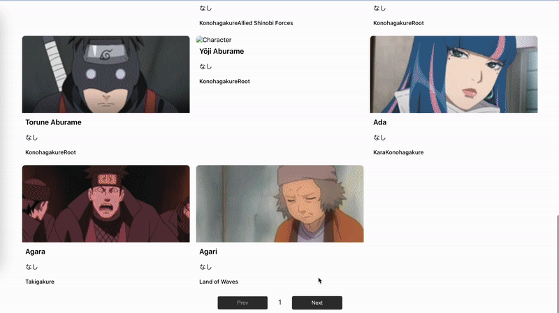
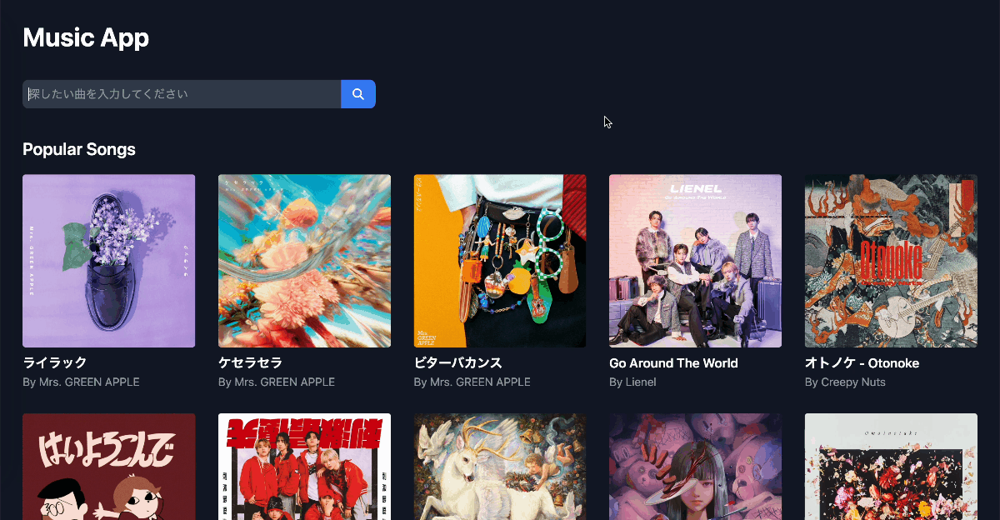
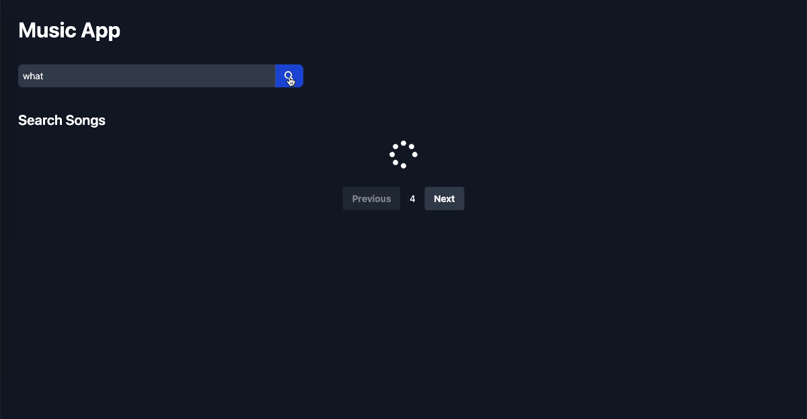
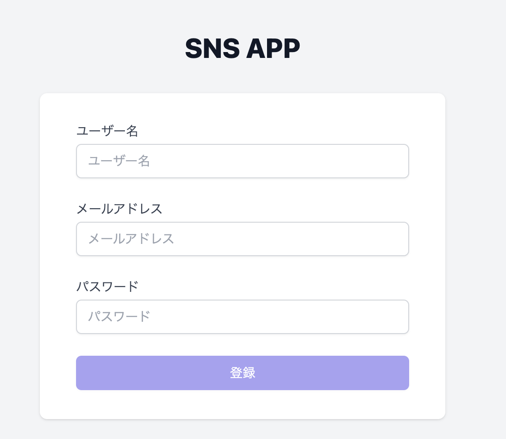
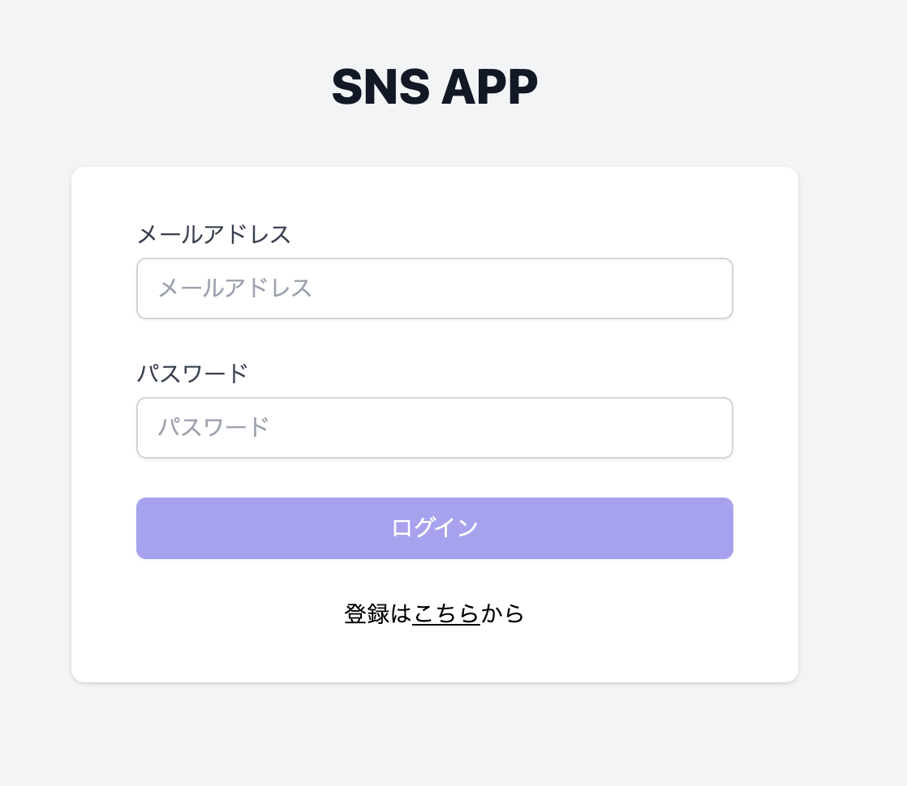
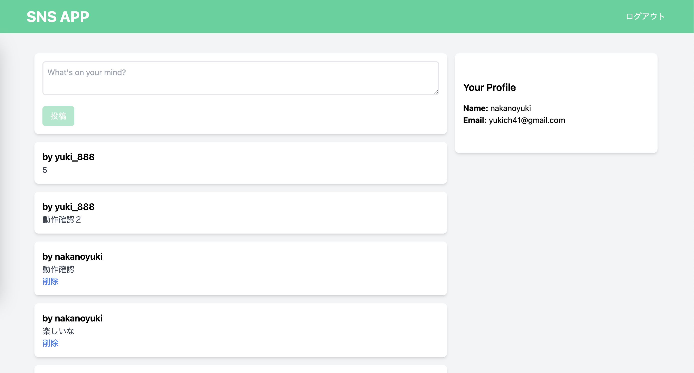

# udemy_react-product-development

Udemy講座　
[「就職/転職で有利なポートフォリオに！ 基礎〜応用4つのReactアプリで実践的な開発を学ぼう」](https://www.udemy.com/course/react-product-development/)

## 1.NARUTO図鑑

[NARUTO DB](https://narutodb.xyz/docs/characters/getAllCharacters)からデータを取得し表示

## 2.Spotify人気の音楽表示＆検索アプリ

[Spotify API](https://narutodb.xyz/docs/characters/getAllCharacters)からデータを取得し人気の音楽を表示　検索できるアプリ

- 人気の音楽

- 検索結果

## ログイン機能付き投稿アプリ

- 新規登録

- ログイン

- 投稿&投稿一覧ページ
